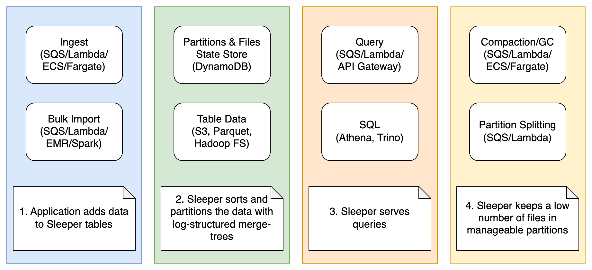
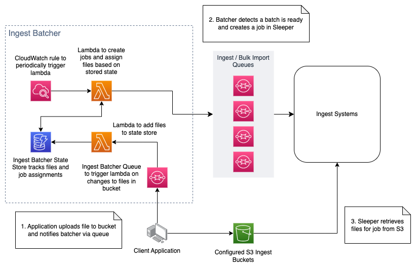

Design
======

This section describes the design of Sleeper. It starts with an overview of the data structure that Sleeper is based
on, followed by a detailed description of the design.

Sleeper is based on the log-structured merge tree. This data structure is designed to support high rates of data
ingest, and to support quick retrieval of records by a key field. To achieve this, the records are stored in a small
number of files that are sorted by key. As records are continually arriving, it is necessary to merge old files with
new files in order to ensure that the number of files remains small. This is called a compaction. As Sleeper is a
large-scale system, data is also range-partitioned by key. Over time partitions can be split if they become larger
than a threshold.

## A Sleeper instance

An instance of Sleeper is identified by a string id that should be globally unique across AWS. A Sleeper
instance has a set of instance properties associated with it. Some of these properties are defined by the user
when the instance is created, others are defined by the CDK deployment process. These properties are stored
in a properties file, which is stored in a bucket in S3. The name of this S3 bucket is `sleeper-` followed by the
instance id followed by `-config`, e.g. `sleeper-mySleeperInstance-config`.

An instance of Sleeper can contain one or more tables. Each table contains records with fields matching a schema.
Each table has its own folder in a shared S3 bucket for storing data and a state store for storing metadata about that table.

The Sleeper instance also contains infrastructure to ingest data, compact data, garbage collect data, split
partitions, execute queries, and run Athena queries. Each of these are provided by a separate CDK stack. All of
these are optional, but in practice the compaction, garbage collection and partition splitting stacks are essential.

The following diagram shows the architecture of Sleeper.

## Records

Records are the fundamental unit of data in Sleeper. A record is simply a map from a field name to a value, i.e.
`Map<String, Object>` where the object should be one of the supported types. For example, we might have a record
with 3 fields: `id -> "abc"`, `timestamp -> 1234567980`, `value -> "hello"`.

## Schema

A schema specifies the fields that will be found in records in a table. Each field has a name and a type. There are
three different classes of fields: row fields, sort fields, and value fields. The row fields are used to partition
and sort the data, i.e. all records with the same values of the row fields are within the same partition, and a
partition contains a range of values of the row fields. Within a partition, records are stored sorted by the row
fields and then the sort fields. The following types are supported for row and sort fields: int, long, string,
byte array. Value fields can be one of these primitive types but can also be of map or list type.

Sleeper is designed to allow quick retrieval of records where the key field is a given value, or where the key
field is in a certain range. Note that the row fields and sort fields are ordered, e.g. if there are two row key
fields id1 and id2, then records are stored sorted by id1 and, in the case of ties, by id2. This means that queries
for records where id1 = x and id2 = y will be quick, as will queries that just specify id1. But queries that just
specify id2 will not be quick as they will require a full scan of the table (although file-level statistics can
sometimes be used to avoid reading a lot of the data).

## Tables

All records in a table conform to a schema. The records in a table are stored in multiple files, with each file
belonging to a partition. These files are all stored in an S3 bucket deployed at an instance level, referred to as 
the data bucket.

Each table has a state store associated to it. This stores metadata about the table, namely the files that are in
the table and how the records in the table are partitioned.

When an instance is deployed, it creates an S3 data bucket and creates the infrastructure for all future state stores. 
When a table is created, a state store for that table is initialised (to achieve this, state store implementations 
support storing metadata for files in all tables).

Tables can also be taken offline and put online. Offline tables will be ignored when it comes to finding partitions 
that need splitting and creating compaction jobs. You are still able to ingest files to them, and perform queries 
against them. When creating a new table, the boolean table property `sleeper.table.online` determines whether a table 
starts online or offline. This property defaults to `true`.

## Sorted files

Records in a table are stored in files. The records in each file are stored sorted by row key and sort keys. Currently
data is always stored in Parquet files (support for Rfiles will be added). The files used must support retrieving
individual rows by key (assuming the file is sorted by key) without needing to read the entire file. Parquet supports
this because it stores a footer than contains the minimum and maximum values of each column, by both row group and
page. This means that to retrieve a row where the key field takes a value only requires reading one page per column.
Pages are small (128KiB by default), so even if the file is many GiBs in size only a few hundred KiB need to be read
to retrieve an individual row.

## Partitions

Data within a table is split into partitions. Each partition contains records with keys from a certain range, e.g.
if the row key field is an integer then there might be two partitions, one for records with key less than 0 and one
for records with key greater than or equal to 0. Each record exists in one and only one partition. Partitions are
closed on the left, and open on the right, i.e. the minimum value of a partition is contained within the partition,
but the maximum value is not. For example if the row key field is a string then there could be two partitions, one
for strings up to, but not including 'G', and one for strings 'G' and greater. The first partition would be written
["", "G") and the second would be ["G", null). This notation indicates that the smallest possible value in the first
partition is the empty string, and that every string up to, but not including, "G" is in that partition. In the
second partition, the string "G" is the smallest possible string in that partition, and the null indicates that there
is no maximum value for strings in that partition.

## Partition splitting

Over time a partition may contain more records than a certain threshold and if this happens the partition will be
split into two child partitions. Over time this process builds up a tree of partitions. We think of this tree
upside-down, i.e. the tree grows downwards with the root at the top and the leaves at the bottom. The root partition
is the only partition with no parent. A leaf partition has no children.

The partition splitting process periodically checks for leaf partitions that have become larger than the specified
maximum partition size. The size of a partition can be determined from the state store as that records the number of
records in each file, and which partition a file is in. When a partition that is too large is found a partition
splitting job is created and sent to an SQS queue. When a job arrives on this queue, a lambda processes it. To split
the partition, the lambda identifies the midpoint of the partition. It then creates two child partitions, and calls
the state store to add these two new partitions and to change the status of the parent partition to be a non-leaf.
This update is done atomically, conditional on the parent partition still being marked as a leaf partition. This
atomic, conditional, update ensures that a partition cannot be split twice.

How is the midpoint of a partition identified? Whenever a file is written out, either during the ingest process or
as the result of a compaction, a sidecar quantiles sketch file is written. This quantiles sketch allows quick estimation
of the quantiles of the keys in the file. Quantile sketches from different files can be merged together. To identify
the midpoint of a partition, the list of active files is retrieved from the state store. The associated sketches
are read from S3, and merged together. Then the median is found and used as the split point. This approach is much
quicker than reading all the data in sorted order and stopping once half the data has been read.

The partition splitting stack has two parts. The first consists of a Cloudwatch rule that periodically executes
a lambda that runs `sleeper.splitter.lambda.FindPartitionsToSplitLambda`. For each online table, this queries the 
state store to find the leaf partitions and the active files. For each leaf partition it then calculates the 
number of records and if that is greater than a threshold it sends a message to an SQS queue saying that this partition 
should be split. The second part of the stack is the lambda that is triggered when a message arrives on the SQS queue. 
This lambda executes `sleeper.splitter.lambda.SplitPartitionLambda`. This splits the partition using the process 
described in the previous paragraph.

Note that this partition splitting process happens independently of other parts of Sleeper. For example, the ingest
process needs to write data to leaf partitions. But if one of those partitions is split during this ingest process,
it does not matter. The partition that is split still exists and can still receive data. Similarly, the code that
executes queries periodically queries the state store for the current partitions and files. It then executes queries
by reading the appropriate files. If compactions finish or partitions are split in the time between the query executor
getting the partitions and files from the state store and the query being executed, it does not matter. It does not
make any difference to the results.

## State store

The state store for a table holds information about the files that are currently in the table,
and how those files are partitioned. Information about files is stored by creating file references, and by
keeping track of the number of references to a file. A file reference represents a subset of the data in a file that
exists entirely within a partition. This means you can have multiple references to the same file,
spread across multiple partitions.

The state store allows for information about the file references in a partition to be retrieved,
new file references to be added, a list of all the partitions to be retrieved, etc. It also allows the results
of a compaction job to be atomically committed in which the references to the input files are removed,
and a new reference is created for the output file. Note that a file with no references is still tracked in
the state store.

There are currently two state store implementations, one that stores the data in DynamoDB and one that stores it
in Parquet files in S3 with a lightweight consistency layer in DynamoDB.

### DynamoDB state store

The DynamoDB state store uses three DynamoDB tables to store the state of a table. There is one table for file
references, one for the number of references to a file (or the file reference count), and one for information about the
partitions in the system. For the file reference and file reference count tables, the primary key is a concatenation of
the filename and the partition id. For the partition table, the primary key is simply the id of the partition. Updates
to the state that need to be executed atomically are wrapped in DynamoDB transactions. The number of items in a DynamoDB
transaction is limited to 100. This has implications for the number of files that can be read in a compaction job. When
the job finishes, the relevant references to the input files that the compaction job has read need to be removed, the
output file need to be written, a new file reference to the output file needs to be added to the state store, and the
file reference count needs to be updated. This means that at most 49 files can be read by a compaction job if the
DynamoDB state store is used.

### S3 state store

This state store stores the state of a table in Parquet files in S3, within the same bucket used to store the data
for the table. There is one file for information about file references, and one for the partitions. When an update
happens a new file is written. This new file contains the complete information about the state, i.e., it does not just
contain the updated information. As two processes may attempt to update the information simultaneously, there needs
to be a consistency mechanism to ensure that only one update can succeed. A table in DynamoDB is used as this
consistency layer.

### Potential alternatives

We are considering alternative designs for the state store:

- [A transaction log stored in DynamoDB, with snapshots in S3](designs/transaction-log-state-store.md)
- [A PostgreSQL database](designs/postgresql-state-store.md)

## Ingest of data

To ingest data to a table, it is necessary to write files of sorted records. Each file should contain data for one
and only one partition. When these files have been written to S3, the state store needs to be updated. There are
two ways to do this: standard ingest and bulk import.

### Standard ingest

Standard ingest is performed by the `sleeper.ingest.IngestRecords` class. This performs ingest using the following
steps:

- A batch of records is read into memory.
- This batch is sorted in memory and then flushed to a local file.
- The above two steps are repeated until a certain number of records have been written locally.
- The state store is then queried for all leaf partitions.
- As the local files are all sorted, it is possible to run a streaming merge of these files to produce a sorted
  iterable of records. This sorted iterable is then used to write records to files in S3, with one file per leaf
  partition.
- Once these files have been written to S3 then the state store is updated.

Note that once the ingest process is ready to start writing data to the S3 data bucket, it queries the state
store for the current leaf partitions. It then writes data to files in these leaf partitions. During the process
of writing this data the partition splitting stack may decide to split a partition. But this does not effect
the correctness of the ingest process. The partitions that the ingest process is writing to still exist, and can
still receive data. The fact that some of those partitions may no longer be leaf partitions does not matter. All
that matters is that the ingest process writes files of data such that each file contains data for one and only
one partition.

Users can avoid the complexity of deploying and running multiple instances of the `IngestRecords` class by
writing the data that they wish to ingest into Parquet files and then sending a message to a queue telling Sleeper
to ingest that data. This then causes ECS tasks to run to perform the ingest. These tasks are calling the
`IngestRecords` class on an iterable of records that simply reads the Parquet files.

The resources that provide this functionality are deployed by the ingest stack. The user sends a message to
the SQS queue containing details of the files to be ingested. The ingest stack consists of the SQS queue to
which messages are sent, and the ECS cluster and Fargate task definition which will be used to execute the
ingest jobs. The number of Fargate tasks that are running scales down naturally as the tasks terminate if
there are no more messages on the SQS queue. To scale up the number of tasks, a Cloudwatch rule
periodically triggers a lambda. This lambda looks at the number of messages on the queue that are not being
processed and if necessary creates more Fargate tasks. The maximum number of concurrent Fargate tasks is configurable.

### Bulk import

A bulk import is a process of ingesting data into a Sleeper table using Spark to perform the partitioning
and sorting of the data. This Spark job runs on either an EMR or an EKS cluster (the latter is experimental).
There are two variations of the EMR-based bulk import. The first is an on-demand approach. The user sends a
message to a queue with a list of the files that they want to ingest. This triggers a lambda that creates an
EMR cluster to perform that ingest. As this cluster is created specifically for this job, the job needs to
contain a large number of records. The cluster will take around 10 minutes to create.

The other EMR-based approach uses a persistent, i.e. long running, EMR cluster. A process on the master node
of the cluster monitors a queue and when a job appears submits it to YARN for execution. The EMR cluster can
either be of fixed size or use EMR managed scaling.

### Ingest batcher

The ingest batcher groups ingest requests for individual files into ingest or bulk import jobs. File ingest requests are
submitted to an SQS queue. The batcher is then triggered periodically to group files into jobs and send them to the
ingest queue configured for the table. The number of jobs created is determined by the configuration of the batcher.

The files need to be accessible to the relevant ingest system, but are not read directly by the batcher.

An outline of the design of this system is shown below:

## Compactions

The purpose of a compaction job is to read N files and replace them with one file. This process keeps the number
of files for a partition small, which means the number of files that need to be read in a query is small. The input
files contain records sorted by key and sort fields, and are filtered so that only data for the current partition is
read. The data for an input file that exists within a specific partition can be represented by a file reference.
The output from the job is a sorted file. As the filtered input files are sorted, it is simple to write out a sorted
file containing their data. The output file will be written to the same partition that the input files were in.
Note that the input files for a compaction job must be in the same leaf partition.

When a compaction job finishes, it needs to update the state store to remove the references representing the input
files in that partition, create a new reference to the output file, and update the relevant file reference counts.
This update must be done atomically, to avoid clients that are requesting the state of the state store from seeing an
inconsistent view.

The CDK compaction stack deploys the infrastructure that is used to create and execute compaction jobs. A compaction
job reads in N input files and merges them into 1 file. As the input files are all sorted by key, this job is a
simple streaming merge that requires negligible amounts of memory. The input files are all from a single partition.

There are two separate stages: the creation of compaction jobs, and the execution of those jobs. Compaction jobs
are created by a lambda that runs the class `sleeper.compaction.job.creation.lambda.CreateCompactionJobsLambda`. This
lambda is triggered periodically by a Cloudwatch rule. For each online table, it performs a pre-splitting operation 
on file references in the state store. This involves looking for file references that exist within non-leaf partitions, 
and atomically removing the original reference and creating 2 new references in the child partitions. This only moves
file references down one "level" on each execution of the lambda, so the lambda would need to be invoked multiple times
for the file references in the root partition to be moved down to the bottom of the tree.

The lambda then queries the state store for information about the partitions and the file
references that do not have a job id (if a file reference has a job id it means that a compaction job has already been
created for that file). It then uses a compaction strategy to decide what compaction jobs should be created.
The compaction strategy can be configured independently for each table. The current compaction strategies will only
create compaction jobs for files that are in leaf partitions at the time of creation (meaning a partition split could
happen after a job has been created, but before the job has run). Jobs that are created by the strategy are sent
to an SQS queue.

Compaction jobs are executed in containers. Currently, these containers are executed in Fargate tasks, but they could
be executed on ECS running on EC2 instances, or anywhere that supports running Docker containers. These containers
retrieve compaction jobs from the SQS queue and execute them. Executing them involves a streaming merge of the
N input files into one sorted file. Once the job is finished, the state store is updated. The number of Fargate
tasks that are running scales down naturally as the task terminates if there are no more messages on the SQS queue.
To scale up the number of tasks, a Cloudwatch rule periodically triggers a lambda. This lambda looks at the number
of messages on the queue that are not being processed and if necessary creates more Fargate tasks. The maximum
number of concurrent compaction tasks is configurable.

## Garbage collection

A file is ready for garbage collection if there are no longer any references to the file in the state store,
and the last update was than N minutes ago, where N is a parameter that can be configured separately for each table.
The default value of N is 10 minutes. The reason for not deleting the file immediately as soon as the file no longer
has any references is that it may be being used by queries.

The garbage collector stack is responsible for deleting files that no longer have any references. It consists of
a Cloudwatch rule that periodically triggers a lambda. This lambda iterates through all the tables. For each table
it queries the state store to retrieve all the files that do not have any references and have been waiting for
more than N minutes. These files are then deleted in batches.

## Queries

A Sleeper query is a request for all records where the key is in a range (or in one of a list of ranges). Queries
are executed by the `QueryExecutor` class. This contains a cache of the information required from the state store
(namely the partition tree and the active files). This cache is refreshed periodically. When a query is received,
the requested ranges are examined to see which leaf partitions overlap with the range. Then all partitions up
the partition tree from the leaf partition to the root are found. Records that are relevant to the query may be
found in any of these partitions. All the active files in these partitions are then found. Each file is opened
with a filter that specifies the required range. A streaming merge of the results is performed, with these results
being passed through the compaction and query time iterators.

If the ranges span multiple leaf partitions, then the query is split up into multiple sub-queries, one per leaf
partition.

Queries can be executed directly from Java. Sleeper also allows queries to be executed in
lambdas. Queries are sent to an SQS queue. A lambda picks up this message. If the query only overlaps one partition
then it is executed by that lambda. Otherwise the query is broken into subqueries that are placed back on the queue
so that they can be executed in parallel.

## Athena integration

Sleeper allows Athena queries to be run over Sleeper data. This is enabled by the CDK Athena stack. It contains
lambda functions that read Sleeper data and pass it to Athena. This can be done in two ways: with or without the
application of the iterators.

## Iterators

An iterator is a function that is called either during a compaction job or during a query. It allows
logic to be inserted into the compaction or query path. This logic could be used to age-off old data or to
aggregate together values for the same key (e.g. to sum counts associated with the same key). Each iterator is a
function that takes as input a `CloseableIterator<Record>` and returns a `CloseableIterator<Record>`. Examples of
iterators can be found in `sleeper.core.iterator.impl`.

## Status stores

Sleeper includes stores that track the status of jobs as they pass through the system. These status updates are stored
separately from the state of each Sleeper table. The table state is held in the state store, whereas the status stores
are used for reporting.

The status stores allow us to report on how a job has been run, either successfully or with failures. We also report
when a job runs on a specific task, and the status and statistics of each task.

Here a task usually means an ECS task, that runs in an AWS ECS cluster. It is started by a scheduled process, it listens
for jobs on an SQS queue, and processes jobs from the queue until there are no jobs available for a certain period.

As an example, here's a normal lifecycle of a compaction job, starting from an idle instance of Sleeper with nothing
running:

1. A scheduled rule runs a lambda to create compaction jobs.
2. The lambda adds a number of compaction jobs to the SQS queue.
3. A scheduled rule runs a lambda to create tasks in the compaction ECS cluster.
4. The lambda checks the number of compaction jobs on the queue and creates tasks to run them.
5. A compaction task starts, finds a job on the queue, and runs it. Once there are no more jobs it terminates.

Updates are tracked in the status store when a compaction job is created, started in a task, finished in the task, and
when it's committed to the Sleeper table by updating the state store.

Updates are also tracked for a task when when it starts and when it terminates.

Similar tracking is in place for ingest and bulk import.

## Scheduled rules scaling across tables

Most internal operations in a Sleeper instance operate on a schedule. We use CloudWatch scheduled rules to invoke these.
For operations that apply against Sleeper tables, the scheduled rule will actually invoke a trigger lambda. The trigger
lambda creates messages on an SQS FIFO queue to invoke a handler lambda, where each message is for a single Sleeper
table. We use the table ID as the message group ID. When a lambda is triggered by the FIFO queue, AWS will ensure that
only one instance of the lambda is active at a time for a given Sleeper table.

This ensures that the system can scale to an arbitrary number of tables. Each lambda will have the performance that we
expect against a single table. Multiple instances of the same operation are prevented from running at once, e.g.
compaction job creation, garbage collection.
